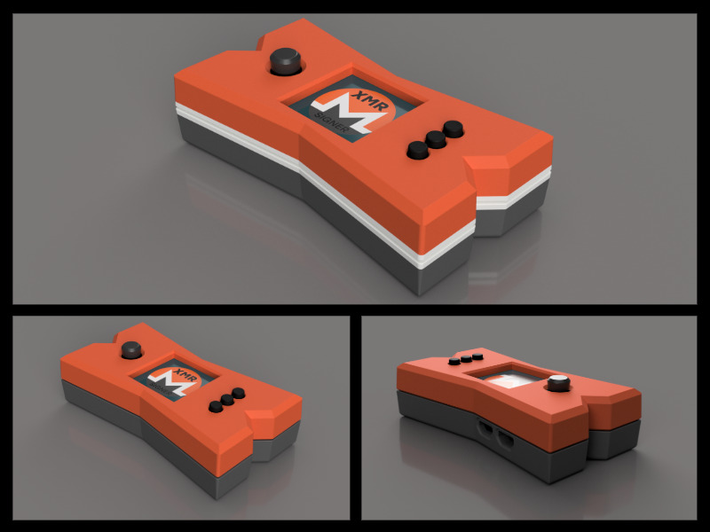

# Build an offline, airgapped Monero signing device for less than $50!

---------------

* [Project Summary](#project-summary)
* [Features](#features)
* [Related Repositories](#related-repositories)
* [Todo](Todo.md)
* [Monero CCS Proposal](https://repo.getmonero.org/monero-project/ccs-proposals/-/merge_requests/465)
* [Shopping List](#shopping-list)
* [Software Installation](#software-installation)
  * [Verifying Your Software](#verifying-your-software)
* [Enclosure Designs](#enclosure-designs)
* [SeedQR Printable Templates](#seedqr-printable-templates)
* [Manual Installation Instructions](#manual-installation-instructions)

---------------

MoneroSigner is in the process of rebranding to XmrSigner, to be not confused to an abandoned project called MoneroSigner.

---------------

# Project Summary

XmrSigner is a fork from [SeedSigner](https://github.com/SeedSigner/seedsigner), Bitcoin signing device. It builds on the same hardware and actually you could use the same device for Monero and Bitcoin with two different microSD cards. MoneroSigner offers anyone the opportunity to build a verifiably air-gapped, stateless Monero signing device using inexpensive, publicly available hardware components (usually < $50).

How Monero is not a direct decendent from Bitcoin a lot of things are different... Really, a lot!

### Features
- [x] Calculate word 13/25 of monero seed phrase
- [x] Create a 25-word monero seed phrase with 99 dice rolls
- [x] Create a 16 word polyseed phrase with 99(?) dice rolls
- [x] Create a 25-word monero seed phrase by taking a digital photo
- [x] Create a 16-word polyseed phrase by taking a digital photo
- [x] Temporarily store up to 3 seed phrases while device is powered
- [ ] ~~Monero passphrase support~~, posponed, possible #rabbit-hole (>48h work to implement in python)
- [x] Polyseed passphrase support
- [ ] ~~Multisig support~~: later
- [x] Scan and parse transaction data from animated QR codes using [UR](https://www.blockchaincommons.com/specifications/Blockchain-Commons-URs-Support-Airgapped-PSBTs/)
- [x] Sign transactions
- [x] Live preview during photo-to-seed and QR scanning UX
- [x] Optimized seed word entry interface
- [x] Support for Monero Mainnet, Stagenet & Testnet
- [x] User-configurable QR code display density (__check: UR documentation about viability__)

### Considerations:
* Built for compatibility using  [UR](https://www.blockchaincommons.com/specifications/Blockchain-Commons-URs-Support-Airgapped-PSBTs/) with Feather Waller, etc, and adapt oficial [Monero GUI](https://www.getmonero.org/downloads/#gui).
* Device takes up to 60 seconds to boot before menu appears (be patient!)
* Always test your setup before transfering larger amounts of monero (try testnet first!)
* Slightly rotating the screen clockwise or counter-clockwise should resolve lighting/glare issues
* If you think XmrSigner adds value to the Monero ecosystem, please help us spread the word! (tweets, pics, videos, etc.)

### Related Repositories
* [This one(XmrSigner)](https://github.com/DiosDelRayo/MoneroSigner)
* [XmrSigner OS](https://github.com/DiosDelRayo/monerosigner-os)
* [Emulator](https://github.com/DiosDelRayo/monerosigner-emulator) forked from [SeedSigner Emulator](https://github.com/enteropositivo/seedsigner-emulator), simple to use and no modifications of the source necessary thanks to overlay mount
* [Polyseed](https://github.com/DiosDelRayo/polyseed-python) transpiled and pythonized from [original Polyseed C-implementation](https://github.com/tevador/polyseed)
* [monero-python](https://github.com/DiosDelRayo/monero-python) fork from from [original](https://github.com/monero-ecosystem/monero-python)
* [monero](https://github.com/DiosDelRayo/monero) fork of [monero](https://github.com/monero-project/monero) to extend `monero-wallet-rpc` with two endpoints for encrypted key images handling
* [Companion Application](https://github.com/DiosDelRayo/XmrSignerCompanion) the Qt 6/C++ Companion Application

## What to expect:
1. Create a PiOS development image with XmrSigner running on it (for development only, not for real use).
2. Fix open imperfections in XmrSigner and XmrSigner Companion code.
3. Make XmrSigner work on XmrSigner OS (buildroot).
4. Create a phone app to test XmrSigner and other offline signing wallets.
5. Write comprehensive documentation.
6. Implement multisig functionality.
7. Potentially develop XmrSigner NG, a slim reimplementation in ~~Go/Zig/Rust or~~ **C++**~~/Qt.~~ (C++ for the ability to switch from XmrSigner OS to bare metal)

The project remains committed to delivering a secure XmrSigner for production, despite the challenges encountered.

---------------

# Shopping List

To build a SeedSigner, you will need:

* Raspberry Pi Zero (preferably version 1.3 with no WiFi/Bluetooth capability, but any Raspberry Pi ~~2/3/4 or~~ Zero model will work)
* Waveshare 1.3" 240x240 pxl LCD (correct pixel count is important, more info at https://www.waveshare.com/wiki/1.3inch_LCD_HAT)
* Pi Zero-compatible camera (tested to work with the Aokin / AuviPal 5MP 1080p with OV5647 Sensor)

Notes:
* You will need to solder the 40 GPIO pins (20 pins per row) to the Raspberry Pi Zero board. If you don't want to solder, purchase "GPIO Hammer Headers" for a solderless experience.
* Other cameras with the above sensor module should work, but may not fit in the Orange Pill enclosure
* Choose the Waveshare screen carefully; make sure to purchase the model that has a resolution of 240x240 pixels

---------------

# Software Installation

At the moment there is only a development image based on Raspberries Pi OS (buster, pretty old),
with bookworm there is stil an issue with picamera2 although I adapted the code to run on both.
After running in similar issues with buster, it could be that it is only a wrong setting in config.txt.

But honestly, this development image was meant that there is at least something running and the
ability to thinker with it, or check things out. But main focus should be to get it on XmrSigner OS
running. Here is the issue to compile monero-wallet-rpc without to bring even more dependencies, which
are by they way all unnecessary becauae absolutely unneeded for the use case, into buidroot.

I will need how to go further and in which direction, monero-wallet-rpc was a temporary solution to
move "quick" after figuring out at monero-python is mostly only a wrapper around monero-wallet-rpc,
but implementing thing like password or key images import/export base on ch_hash_slow (CryptoNight),
there would be a lot to transpile. So the better approach in my opinion and beneficial for all comming
monero developers would be to take monero souce appart modularize it, minimze dependencies and allow
to compile only what you need. And after that reimplement it without monero-wallet-rpc.

Further I think for the XmrSigner itself there are also too much dependencies, and also completely
unnecessary. Essentially XmrSigner doesn't need an OS, it should run bare metal on the Raspberry Pi or
it should be on something like the i.MX from NXP/Freescale. That all let's so many questions open in which
direction to go from here. Input welcome!

---------------

# Enclosure Designs

## Community Designs

[The files to print yourself the enclosure](enclosures/XmrSigner_enclosure) from [@Go Brrr](https://github.com/gobrrrme) [website](https://gobrrr.me) [X](https://twitter.com/Printer_Gobrrr)
[In Go Brrr's repository](https://github.com/gobrrrme/xmrsigner/tree/master/enclosures/XmrSigner_enclosure)

### Designes done for Seedsigner but will work just the same for XmrSigner
* [Lil Pill](https://cults3d.com/en/3d-model/gadget/lil-pill-seedsigner-case) by @_CyberNomad
* [OrangeSurf Case](https://github.com/orangesurf/orangesurf-seedsigner-case) by @OrangeSurfBTC
* [PS4 Seedsigner](https://www.thingiverse.com/thing:5363525) by @Silexperience
* [OpenPill Faceplate](https://www.printables.com/en/model/179924-seedsigner-open-pill-cover-plates-digital-cross-jo) by @Revetuzo 
* [Waveshare CoverPlate](https://cults3d.com/en/3d-model/various/seedsigner-coverplate-for-waveshare-1-3-inch-lcd-hat-with-240x240-pixel-display) by @Adathome1

---------------

# Manual Installation Instructions
see the docs: [Manual Installation Instructions](docs/manual_installation.md) (To be updated)
